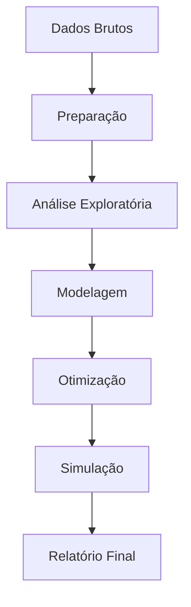

# 📚 Documentação Técnica - Projeto Pokémon Elite dos 4

## 🎯 Visão Geral

Este documento descreve a implementação técnica completa do projeto de análise para determinar o melhor quinteto de Pokémon para vencer a Elite dos 4 nos jogos Pokémon Red/Green.

## 🏗️ Arquitetura do Sistema

### Estrutura de Diretórios
```
Projeto_Final_PDA/
├── config.R                          # Configurações do projeto
├── README.md                         # Documentação principal
├── requirements.txt                  # Dependências R
├── data/                            # Datasets originais
│   ├── pokemon_data.csv            # Dados dos 151 Pokémon
│   └── elite_four_data.csv         # Dados da Elite dos 4
├── scripts/                         # Scripts de análise
│   ├── install_packages.R          # Instalação de pacotes
│   ├── 01_data_preparation.R       # Preparação de dados
│   ├── 02_exploratory_analysis.R   # Análise exploratória
│   ├── 03_statistical_modeling.R   # Modelagem estatística
│   ├── 04_team_optimization.R      # Otimização do quinteto
│   ├── 05_battle_simulation.R      # Simulação de batalhas
│   └── main_analysis.R             # Script principal
├── output/                          # Resultados gerados
│   ├── plots/                      # Gráficos e visualizações
│   ├── tables/                     # Tabelas de dados
│   ├── models/                     # Modelos treinados
│   └── reports/                    # Relatórios gerados
└── docs/                           # Documentação técnica
```

## 🔧 Tecnologias Utilizadas

### Linguagem Principal
- **R** (versão 4.0+)

### Pacotes Principais
- **Análise de Dados**: `dplyr`, `tidyr`, `readr`
- **Visualização**: `ggplot2`, `plotly`, `corrplot`
- **Machine Learning**: `caret`, `randomForest`, `glmnet`
- **Otimização**: `GA` (Algoritmos Genéticos)
- **Relatórios**: `rmarkdown`, `knitr`

## 📊 Modelo de Dados

### Dataset de Pokémon
```r
pokemon_data <- data.frame(
  id = integer(),           # ID único do Pokémon
  name = character(),       # Nome do Pokémon
  type1 = character(),      # Tipo primário
  type2 = character(),      # Tipo secundário (opcional)
  hp = integer(),          # Pontos de vida
  attack = integer(),      # Ataque
  defense = integer(),     # Defesa
  sp_attack = integer(),   # Ataque especial
  sp_defense = integer(),  # Defesa especial
  speed = integer(),       # Velocidade
  total = integer(),       # Total das estatísticas
  generation = integer()   # Geração
)
```

### Dataset da Elite dos 4
```r
elite_four_data <- data.frame(
  member = character(),     # Nome do membro
  position = integer(),     # Posição na Elite
  pokemon1 = character(),   # Primeiro Pokémon
  pokemon1_type1 = character(), # Tipo do primeiro Pokémon
  pokemon1_level = integer(),   # Nível do primeiro Pokémon
  # ... (repetir para pokemon2 até pokemon5)
)
```

## 🧮 Algoritmos Implementados

### 1. Preparação de Dados
- **Limpeza**: Remoção de valores ausentes e outliers
- **Normalização**: Padronização das estatísticas
- **Feature Engineering**: Criação de variáveis derivadas

### 2. Análise Exploratória
- **Estatísticas Descritivas**: Média, mediana, desvio padrão
- **Distribuições**: Histogramas e gráficos de densidade
- **Correlações**: Matriz de correlação entre variáveis
- **Análise de Tipos**: Efetividade e vantagens de tipo

### 3. Modelagem Estatística
- **Random Forest**: Para classificação de eficácia
- **Validação Cruzada**: 5-fold com 3 repetições
- **Métricas de Avaliação**: Acurácia, precisão, recall, F1-score

### 4. Otimização do Quinteto
- **Algoritmo Genético**: 
  - População: 50 indivíduos
  - Gerações: 100
  - Taxa de mutação: 10%
  - Taxa de crossover: 80%
- **Função Objetivo**: Maximizar vantagem de tipo e estatísticas

### 5. Simulação de Batalhas
- **Sistema de Turnos**: Baseado na velocidade dos Pokémon
- **Cálculo de Dano**: Fórmula simplificada do Pokémon
- **Vantagens de Tipo**: Multiplicadores de dano
- **Variação Aleatória**: 85-100% do dano base

## 📈 Fluxo de Processamento

### Pipeline Principal


### Etapas Detalhadas

#### 1. Preparação de Dados
```r
# Carregar dados
pokemon_data <- read_csv("data/pokemon_data.csv")
elite_four_data <- read_csv("data/elite_four_data.csv")

# Limpeza e normalização
pokemon_clean <- pokemon_data %>%
  filter(!is.na(total)) %>%
  mutate(
    hp_norm = hp / max(hp, na.rm = TRUE),
    attack_norm = attack / max(attack, na.rm = TRUE),
    # ... outras normalizações
  )
```

#### 2. Análise Exploratória
```r
# Estatísticas descritivas
summary_stats <- pokemon_clean %>%
  group_by(type1) %>%
  summarise(
    avg_hp = mean(hp, na.rm = TRUE),
    avg_attack = mean(attack, na.rm = TRUE),
    # ... outras estatísticas
  )

# Visualizações
ggplot(pokemon_clean, aes(x = type1, y = total)) +
  geom_boxplot() +
  theme_minimal()
```

#### 3. Modelagem
```r
# Preparar dados para modelagem
model_data <- pokemon_clean %>%
  select(-id, -name, -generation) %>%
  mutate(effectiveness = as.factor(effectiveness))

# Treinar Random Forest
rf_model <- randomForest(
  effectiveness ~ .,
  data = model_data,
  ntree = 500,
  mtry = 3
)
```

#### 4. Otimização
```r
# Função de fitness para algoritmo genético
fitness_function <- function(team_indices) {
  team <- pokemon_data[team_indices, ]
  
  # Calcular vantagem de tipo
  type_advantage <- calculate_type_advantage(team)
  
  # Calcular estatísticas balanceadas
  stats_balance <- calculate_stats_balance(team)
  
  return(type_advantage * stats_balance)
}

# Executar algoritmo genético
ga_result <- ga(
  type = "binary",
  nBits = nrow(pokemon_data),
  fitness = fitness_function,
  popSize = 50,
  maxiter = 100
)
```

#### 5. Simulação
```r
# Simular batalha individual
simulate_battle <- function(player_pokemon, enemy_pokemon, 
                           player_level, enemy_level) {
  
  # Ajustar estatísticas por nível
  player_hp <- player_pokemon$hp * player_level / 100
  player_attack <- player_pokemon$attack * player_level / 100
  
  # Simular turnos
  while (player_hp > 0 && enemy_hp > 0) {
    # Calcular dano
    damage <- calculate_damage(player_attack, enemy_defense, 
                              type_advantage)
    
    # Aplicar dano
    enemy_hp <- enemy_hp - damage
    
    # Verificar vitória
    if (enemy_hp <= 0) return("Victory")
    
    # Inimigo ataca (lógica similar)
  }
}
```

## 🎮 Sistema de Batalha

### Mecânicas Implementadas

#### Cálculo de Dano
```r
calculate_damage <- function(attacker_attack, attacker_level, 
                            defender_defense, defender_level, 
                            type_advantage = 1.0) {
  
  # Fórmula baseada no sistema Pokémon
  base_damage <- ((2 * attacker_level / 5 + 2) * 
                   attacker_attack * 60 / defender_defense) / 50 + 2
  
  # Aplicar vantagem de tipo
  damage <- base_damage * type_advantage
  
  # Adicionar variação aleatória
  damage <- damage * runif(1, 0.85, 1.0)
  
  return(max(1, round(damage)))
}
```

#### Vantagens de Tipo
```r
get_type_advantage <- function(attacker_type, defender_type) {
  # Matriz de vantagens
  type_advantages <- list(
    Fire = c("Grass", "Ice", "Bug"),
    Water = c("Fire", "Ground", "Rock"),
    Grass = c("Water", "Ground", "Rock"),
    # ... outros tipos
  )
  
  if (attacker_type %in% names(type_advantages)) {
    if (defender_type %in% type_advantages[[attacker_type]]) {
      return(2.0)  # Super efetivo
    }
  }
  return(1.0)  # Normal
}
```

## 📊 Métricas de Avaliação

### Performance dos Modelos
- **Acurácia**: Proporção de predições corretas
- **Precisão**: Proporção de predições positivas corretas
- **Recall**: Proporção de casos positivos identificados
- **F1-Score**: Média harmônica entre precisão e recall

### Eficácia do Quinteto
- **Taxa de Vitória**: Proporção de batalhas vencidas
- **Tempo de Batalha**: Número médio de turnos
- **HP Restante**: Vida média restante após vitória
- **Cobertura de Tipo**: Variedade de tipos no time

## 🔍 Análise de Resultados

### Interpretação dos Dados
1. **Distribuição de Estatísticas**: Identificar Pokémon com estatísticas balanceadas
2. **Correlações**: Entender relações entre diferentes atributos
3. **Análise de Tipo**: Determinar combinações eficazes
4. **Performance em Batalha**: Validar eficácia do time otimizado

### Validação dos Modelos
- **Holdout Set**: 20% dos dados para validação final
- **Cross-Validation**: 5-fold para estimar performance real
- **Bootstrap**: Para estimar intervalos de confiança

## 🚀 Execução do Projeto

### Pré-requisitos
1. **R** instalado (versão 4.0+)
2. **RStudio** (recomendado)
3. **Pacotes R** listados em `requirements.txt`

### Comandos de Execução
```r
# 1. Carregar configurações
source("config.R")

# 2. Executar análise completa
source("scripts/main_analysis.R")

# 3. Executar etapas individuais
source("scripts/01_data_preparation.R")
source("scripts/02_exploratory_analysis.R")
# ... outras etapas
```

### Monitoramento
- **Logs**: Saída detalhada no console
- **Progresso**: Indicadores de progresso para cada etapa
- **Arquivos**: Resultados salvos automaticamente

## 📝 Manutenção e Extensibilidade

### Adicionar Novos Pokémon
1. Incluir dados no `pokemon_data.csv`
2. Executar pipeline de preparação
3. Recalcular modelos e otimizações

### Modificar Parâmetros de Batalha
1. Ajustar valores em `config.R`
2. Modificar funções de simulação
3. Reexecutar simulações

### Novos Algoritmos
1. Implementar nova função de fitness
2. Adicionar parâmetros de configuração
3. Integrar ao pipeline principal

## 🐛 Solução de Problemas

### Problemas Comuns
1. **Pacotes não instalados**: Executar `install_packages.R`
2. **Arquivos não encontrados**: Verificar estrutura de diretórios
3. **Erros de memória**: Reduzir tamanho da população GA
4. **Tempo de execução**: Ajustar parâmetros de convergência

### Debug
- **Logs detalhados**: Ativar em `config.R`
- **Verificação de dados**: Funções de validação incluídas
- **Testes unitários**: Scripts de teste separados

## 📚 Referências

### Documentação R
- [R Base](https://cran.r-project.org/manuals.html)
- [dplyr](https://dplyr.tidyverse.org/)
- [ggplot2](https://ggplot2.tidyverse.org/)
- [caret](https://topepo.github.io/caret/)

### Algoritmos
- [Random Forest](https://en.wikipedia.org/wiki/Random_forest)
- [Genetic Algorithms](https://en.wikipedia.org/wiki/Genetic_algorithm)
- [Cross-Validation](https://en.wikipedia.org/wiki/Cross-validation_(statistics))

### Pokémon
- [Bulbapedia](https://bulbapedia.bulbagarden.net/)
- [Pokémon Database](https://pokemondb.net/)

---

*Documentação gerada automaticamente - Projeto Pokémon Elite dos 4*
